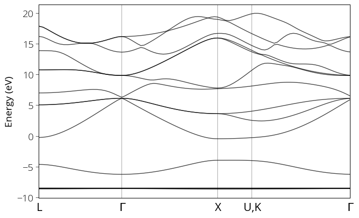

### Calculating bandstructure of GaAs 

Now that we have calculated the bandstructure of silicon (semiconductor) and aluminum (metal), let us proceed with a compound which has two different atoms. We follow the steps like before: 


1) First check the lattice constant with cell relaxation according to our chosen pseudo potential. We use that lattice constant in our next steps. 
Our lattice constant = 10.6867 * 0.508176602 / 0.5 = 10.861462. 
```
pw.x < GaAs.relax.in > GaAs.relax.out
```

2) Perform self consistent field calculation. 
```
pw.x < GaAs.scf.in > GaAs.scf.out
```

3) Give denser k-points and perform non-self consistent calculation  
```
pw.x < GaAs.nscf.in > GaAs.nscf.out
```

4) Perform bandstructure calculation 
```
pw.x < GaAs.bands.in > GaAs.bands.out 
```

5) Post process the data and plot the bandstructure. 
```
bands.x < GaAs.bands-pp.in > GaAs.bands-pp.out 
plotband.x
```
If everything goes well, you will get the bandstructure as below: 

{:style="width:600px"} 
