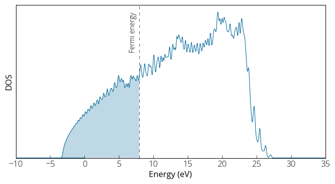
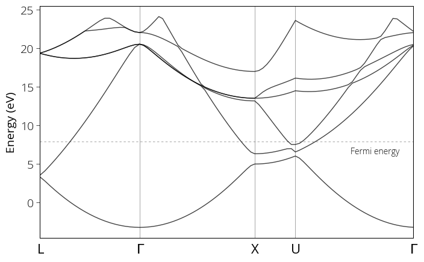

### Calculating bandstructure of Aluminum 

##### 1) Cell relaxation 
First we are going to relax the cell and choose appropriate lattice constant for our chosen pseudo potential. In case of metal, it is important to provide smearing parameters in the input file. 

``` 
&CONTROL
  calculation= 'vc-relax',
  prefix= 'al',
  outdir= './tmp/'
  pseudo_dir = './'
  etot_conv_thr= 1e-6,
  forc_conv_thr= 1e-5
/

&SYSTEM
  ibrav=  2,
  celldm(1)= 7.652,
  nat=  1,
  ntyp= 1,
  ecutwfc = 50,
  ecutrho= 500,
  occupations= 'smearing',
  smearing= 'gaussian',
  degauss= 0.01
/

&ELECTRONS
  conv_thr= 1e-8
/

&IONS
/

&CELL
  cell_dofree= 'ibrav'
/

ATOMIC_SPECIES
  Al 26.981539 Al.pbe-n-rrkjus_psl.1.0.0.UPF

ATOMIC_POSITIONS (alat)
  Al 0.00 0.00 0.00

K_POINTS (automatic)
  10 10 10 0 0 0
```
We run `pw.x` : 
```
pw.x < al.vc-relax.in > al.vc-relax.out 
```
Now you may open the output file in **vi** editor and invoke search by pressing `/` and type *Final enthalpy* You will find the final lattice parameters below it. 
<br>

##### 2) Self consistent field 
We obtain relaxed lattice constant = 7.652 * 0.498611683 / 0.5 = 7.63075 Bohr. We will use this value for our next step, self consistent calculation. 

```
&CONTROL
  calculation= 'scf',
  restart_mode= 'from_scratch',
  prefix= 'al',
  outdir= './tmp/',
  pseudo_dir= './'
/

&SYSTEM
  ibrav= 2,
  celldm(1) = 7.63075,
  nat= 1,
  ntyp= 1,
  ecutwfc= 50,
  ecutrho= 500,
  occupations= 'smearing',
  smearing= 'gaussian',
  degauss= 0.01
/

&ELECTRONS
  conv_thr= 1e-8
/

ATOMIC_POSITIONS (alat)
  Al 0.00 0.00 0.00

K_POINTS (automatic)
  10 10 10 0 0 0
```
We run our self consistent calculation: 
``` 
pw.x < al.scf.in > al.scf.out 
```
<br>

##### 3) Non-self consistent field 
Inspect the output file, and let's proceed to next step non-self consistent calculation: 
```
&CONTROL
  calculation= 'nscf',
  restart_mode= 'from_scratch',
  prefix= 'al',
  outdir= './tmp/',
  pseudo_dir= './'
/

&SYSTEM
  ibrav= 2,
  celldm(1) = 7.63075,
  nat= 1,
  ntyp= 1,
  ecutwfc= 50,
  ecutrho= 500,
  occupations= 'smearing',
  smearing= 'gaussian',
  degauss= 0.01
/

&ELECTRONS
  conv_thr= 1e-8
/

ATOMIC_SPECIES
  Al 26.981539 Al.pbe-n-rrkjus_psl.1.0.0.UPF

ATOMIC_POSITIONS (alat)
  Al 0.00 0.00 0.00

K_POINTS (automatic)
  40 40 40 0 0 0
``` 
Note the changes in input file. The calculation changed to `nscf` and we are now using a higher number of k-points grid. 
```
pw.x < al.nscf.in > al.nscf.out 
```
<br>

##### 4) Density of states
Next we go ahead with our density of states calculation: 
```
&DOS 
  prefix= 'al', 
  outdir= './tmp/', 
  fildos= 'al.dos.dat', 
  emin= -10, 
  emax= 35 
/ 
```
We again run `dos.x` with DOS inputs: 
```
dos.x < al.dos.in > al.dos.out 
```
Note from our *al.nscf.out* that our Fermi energy is at 7.9421 eV. We plot our density of states: 

{:style="width:500px"} 
<br>

##### 5) Bandstructure calculation 
We prepare the input file the same as the case of silicon. 
```
&CONTROL
  calculation= 'bands',
  restart_mode= 'from_scratch',
  prefix= 'al',
  outdir= './tmp/',
  pseudo_dir= './'
/

&SYSTEM
  ibrav= 2,
  celldm(1) = 7.63075,
  nat= 1,
  ntyp= 1,
  ecutwfc= 50,
  ecutrho= 500,
  occupations= 'smearing',
  smearing= 'gaussian',
  degauss= 0.01
/

&ELECTRONS
  conv_thr= 1e-8
/

ATOMIC_SPECIES
  Al 26.981539 Al.pbe-n-rrkjus_psl.1.0.0.UPF

ATOMIC_POSITIONS (alat)
  Al 0.00 0.00 0.00

K_POINTS {crystal_b}
5
  00.000 0.500 00.000 20  !L
  00.000 0.000 00.000 30  !G
  -0.500 0.000 -0.500 10  !X
  -0.375 0.250 -0.375 30  !U
  00.000 0.000 00.000 20  !G
``` 
Followed by run `pw.x` : 
```
pw.x < al.bands.in > al.bands.out 
``` 
Now we proceed with post-processing: 
``` 
&BANDS
  prefix = 'al'
  outdir = './tmp/'
  filband = 'al.bands.dat'
/
```
And run `bands.x` and then `plotband.x` : 
``` 
bands.x < al.bands-pp.in > al.bands-pp.out 
plotband.x
``` 
We obtain the following bandstructure: 

{:style="width:500px"} 
