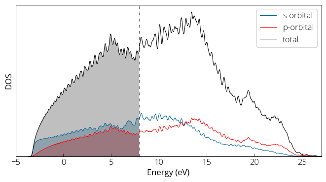

### Projected Density of States 
Often it is needed to know the contribution from each individual atoms and/or each of their orbital contributions. We can achieve that using `projwfc.x` code. First, we must perform the self consistent field calculation followed by the non-self consistent field calculation with denser k-points. Then we prepare the input file for `projwfc.x` : 
``` 
&PROJWFC
  prefix= 'al',
  outdir= './tmp/',
  lwrite_overlaps= .true,
  filpdos= 'al.pdos.dat'
/
``` 
We run the code: 
``` 
projwfc.x < al.projwfc.in > al.projwfc.out 

```
Here is how our projected density of states plot looks like: 

{:style="width:600px"} 

We can perform sums of specific atom or orbital contributions using `sumpdos.x` code if needed: 
``` 
sumpdos.x *\(Al\)* > atom_Al_tot.dat 
sumpdos.x *\(Al\)*\(s\) > atom_Al_s.dat 
sumpdos.x *\(Al\)*\(p\) > atom_Al_p.dat
```
