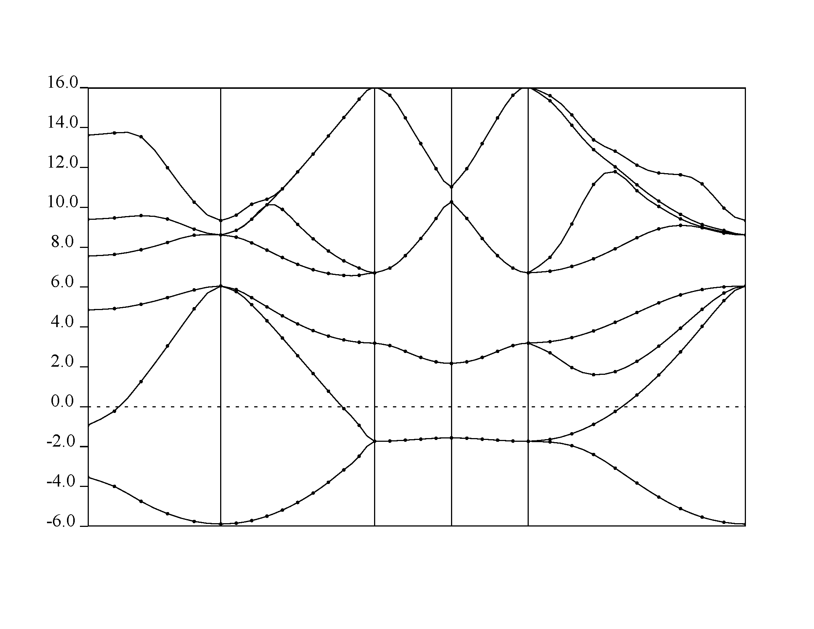

### Bandstructure Calculation

- Again before running our code for band calculation we need to perform self consistent field calculation. We have our input scf file with some new parameters: 
```
&CONTROL
  calculation = 'scf',
  restart_mode = 'from_scratch',
  prefix = 'silicon',
  outdir = './tmp/'
  pseudo_dir = './'
  verbosity = 'high'
/

&SYSTEM
  ibrav =  2,
  celldm(1) = 10.2076,
  nat =  2,
  ntyp = 1,
  ecutwfc = 50,
  ecutrho = 400,
  nbnd = 8,
/

&ELECTRONS
  conv_thr = 1e-8,
  mixing_beta = 0.6
/

ATOMIC_SPECIES
  Si 28.086 Si.pz-vbc.UPF

ATOMIC_POSITIONS (alat)
  Si 0.0 0.0 0.0
  Si 0.25 0.25 0.25

K_POINTS (automatic)
  8 8 8 0 0 0
``` 
We run: 
```
pw.x < si.scf-band.in > si.scf-band.out 
``` 

- Next step is our band calculation (non-self consistent field) calculation. We create the input file for band calculation: 
```
&control
  calculation = 'bands',
  restart_mode = 'from_scratch',
  prefix = 'silicon',
  outdir = './tmp/'
  pseudo_dir = './'
  verbosity = 'high'
/

&system
  ibrav =  2,
  celldm(1) = 10.2076,
  nat =  2,
  ntyp = 1,
  ecutwfc = 50,
  ecutrho = 400,
  nbnd = 8
 /

&electrons
  conv_thr = 1e-8,
  mixing_beta = 0.6
 /

ATOMIC_SPECIES
  Si 28.086  Si.pz-vbc.UPF

ATOMIC_POSITIONS (alat)
  Si 0.00 0.00 0.00
  Si 0.25 0.25 0.25

K_POINTS {crystal_b}
5
  0.0000 0.5000 0.0000 20  !L
  0.0000 0.0000 0.0000 30  !G
  -0.500 0.0000 -0.500 10  !X
  -0.375 0.2500 -0.375 30  !U
  0.0000 0.0000 0.0000 20  !G
``` 
Again run `pw.x`: 
```
pw.x < si.bands.in > si.bands.out 
``` 
The bands are calculated. We need some post processing in order to obtain the data in more usable manner. Input file for `bands.x` :
```
&BANDS
  prefix = 'silicon'
  outdir = './tmp/'
  filband = 'si.bands.dat'
/
```
+ Run `bands.x` : 
```
bands.x < si.bands-pp.in > si.bands-pp.out
```
+ Next we need to run `plotband.x` We can run is interactively as follows (or you can provide an input file instead): 
```
     Input file > si.bands.dat
Reading    8 bands at     91 k-points
Range:   -5.8300   16.3420eV  Emin, Emax > -6, 16
high-symmetry point:  0.5000 0.5000 0.5000   x coordinate   0.0000
high-symmetry point:  0.0000 0.0000 0.0000   x coordinate   0.8660
high-symmetry point:  1.0000 0.0000 0.0000   x coordinate   1.8660
high-symmetry point:  1.0000 0.2500 0.2500   x coordinate   2.2196
high-symmetry point:  0.0000 0.0000 0.0000   x coordinate   3.2802
output file (gnuplot/xmgr) > si.bands.gnuplot
bands in gnuplot/xmgr format written to file si.bands.gnuplot                                                                                                                                                                                                                                                
output file (ps) > si.bands.ps
Efermi > 6.6416
deltaE, reference E (for tics) 4, 0
bands in PostScript format written to file si.bands.ps 
``` 
- You will have *si.bands.ps* with band diagram. Or you can use your favorite plotting program to meet your needs. 

{:style="width:600px"} 
