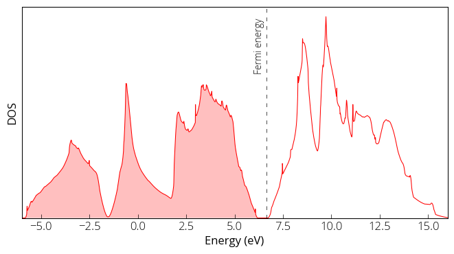

### DOS calculation 

Before we can run the Density of States (DOS) calculation, we need to 

1. Perform self consistent filed (scf) calculation. 
2. Fix the parameters and run non-self consistent field (nscf) calculation. 

I have created a new input file (si.scf-dos.in) which is very much same as our previous scf input file except some parameters are modified. We used the lattice constant value that we obtained from the relaxation calculation. We should not directly use the experimental/real lattice constant value. Depending on the method and pseudo-potential, it might result stress in the system. We have increased the `ecutwfc` to have better precision. We run the calculation: 
```
pw.x < si.scf-dos.in > si.scf-dos.out
``` 
Next, we have prepared the input file for the `nscf` calculation. Where is have added `occupations` in the `&system` card as `tetrahedra`. We have increased the number of k-points to 12 × 12 × 12. You can find all input files in my [GitHub repository](https://github.com/pranabdas/qe-dft/){:target="_blank"}. 
```
pw.x < si.nscf-dos.in > si.nscf-dos.out 
``` 

Now our final step is to calculate the density of states. The DOS input file as follows: 
```
&DOS 
  prefix='silicon', 
  outdir='./tmp/', 
  fildos='si.dos.dat', 
  emin=9.0, 
  emax=16.0 
/ 
``` 
And we run: 
```
dos.x < si.dos.in > si.dos.out 
``` 
Now we can plot the DOS: 

{:style="width:500px"} 
