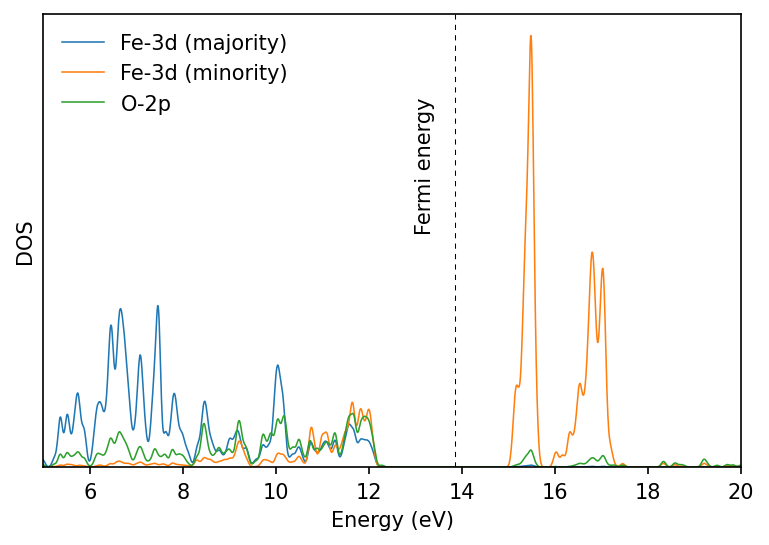

```bash
&SYSTEM
    ...
    lda_plus_u = .TRUE.
    Hubbard_u(i) = 2.0
    ...
/
```
Here `i` refers to the atomic index in the `&ATOMIC_SPECIES` card corresponding
to each `ntyp`. We can specify `Hubbard_u(i)` corresponding to more than one
atom in separate lines.

## DFT calculation for FeO
We will first perform the standard DFT calculation.

1. Perform the SCF calculation:
```bash
pw.x -in feo_scf.in > feo_scf.out
```

2. Perform NSCF calculation with denser k-grid:
```bash
pw.x -in feo_nscf.in > feo_nscf.out
```

3. Perform P-DOS calculation:
```bash
projwfc.x -in feo_projwfc.in > feo_projwfc.out
```


This gives us metallic density of states. In practice we get insulating FeO.

## Calculating Hubbard U
```bash title="src/FeO/feo_hp.in"
&inputhp
   prefix = 'FeO'
   outdir = './tmp/'
   nq1 = 1, nq2 = 1, nq3 = 1
/
```

Perform a linear-response calculation using `hp.x` program:
```bash
hp.x -in feo_hp.in > feo_hp.out
```

Check the file `FeO.Hubbard_parameters.dat`.

## DFT+U calculation
We repeat the calculation after setting in the `&SYSTEM` card:
```bash
Hubbard_U(1) = 4.6
Hubbard_U(2) = 4.6
```

We repeat the above calculation, and plot the results. Now we find insulating
ground state.


