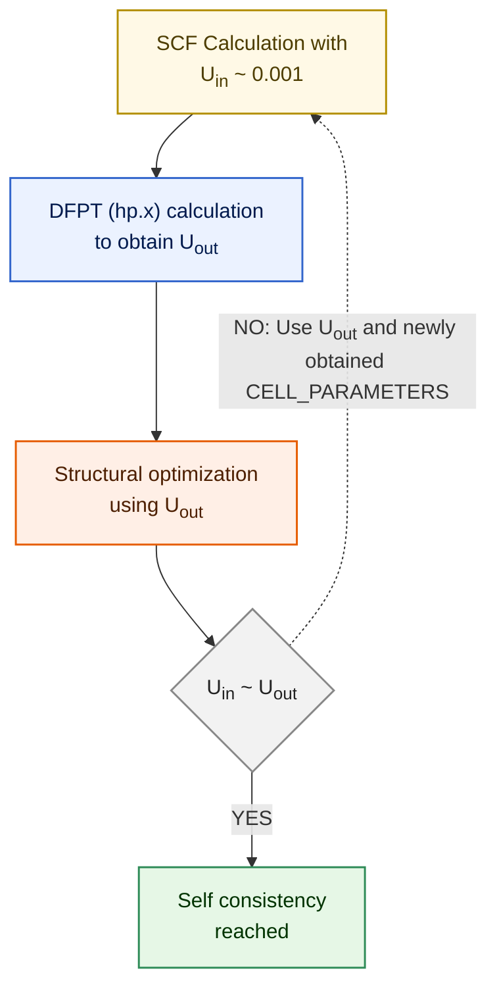

Electronic structure for transition metals (with localized $$d$$ or $$f$$
electrons) is not accurately described by standard DFT, and therefore the need
for DFT+U formulation.

```fortran
&SYSTEM
    ...
    lda_plus_u = .TRUE.
    Hubbard_u(i) = 2.0
    ...
/
```

Here `i` refers to the atomic index in the `&ATOMIC_SPECIES` card corresponding
to each `ntyp`. We can specify `Hubbard_u(i)` corresponding to more than one
atom in separate lines.

There is also $$U_{eff} = U - J$$ implementation in QE. $$J$$ represents on-site
exchange interaction. Number of $$J$$ terms depends on the manifold of localized
electrons. For $$p$$, we have 1; for $$d$$, we have 2; and for $$f$$, we have 3
terms.

```fortran
    ...
    lda_plus_u = .TRUE.
    lda_plus_u_kind = 1
    Hubbard_u(i) = U
    Hubbard_J(k, i) = J_{ki}
    ...
```

:::danger COMMON ERRORS

If you add `Hubbard_u` for elements that is not implemented to have $$U$$ term
in QE, you might see a "pseudopotential not yet inserted" error.

:::

## Changes to input syntax in v7.1

Starting from Quantum Espresso version `7.1`, there are changes to input syntax
for DFT+U calculations. In the new version, instead of defining the necessary
DFT+U parameters, now there is a new Hubbard card.

```diff
&system
...
-  lda_plus_u = .true.,
-  lda_plus_u_kind = 0,
-  U_projection_type = 'atomic',
-  Hubbard_U(1) = 4.6
-  Hubbard_U(2) = 4.6
...
/

+ HUBBARD (ortho-atomic)
+ U Fe1-3d 4.6
+ U Fe2-3d 4.6
```

Please refer to the <a target="_blank"
href={require('/resources/Hubbard_input.pdf').default}>
qe-x.x/Doc/Hubbard_input.pdf</a> for details.

## DFT calculation for FeO

We will first perform the standard DFT calculation.

1. Perform the SCF calculation:
```bash
pw.x -in feo_scf.in > feo_scf.out
```

2. Perform NSCF calculation with denser k-grid:
```bash
pw.x -in feo_nscf.in > feo_nscf.out
```

3. Perform P-DOS calculation:
```bash
projwfc.x -in feo_projwfc.in > feo_projwfc.out
```


This gives us metallic density of states. In practice we get insulating FeO.

## Calculating Hubbard U

import CodeBlock from '@theme/CodeBlock';
import feo_hp_in from '!!raw-loader!/src/FeO/feo_hp.in';

<CodeBlock language="bash" title="src/FeO/feo_hp.in" showLineNumbers>{feo_hp_in}</CodeBlock>

Perform a linear-response calculation using `hp.x` program:
```bash
hp.x -in feo_hp.in > feo_hp.out
```

Check the file `FeO.Hubbard_parameters.dat`.

:::info

1. We need to check the convergence against q-mesh (as well as k-mesh in SCF
calculation). Here $1\times 1\times 1$ mesh is used. **Important:** `lda_plus_u`
must be set to `.true.` during the SCF calculation, $U$ may be set to zero.

2. We can update the obtained $U$ value in our SCF calculation, and repeat
linear response calculation until we have reached self consistency in $U$ value.

3. To go even further one can check the convergence of geometry during $U$
updates.

4. There is also inter-site Hubbard correction DFT+U+V calculation. The results
could be more closer to hybrid functionals like GW. The $V$ can also be
calculated using Quantum Espresso **hp.x** code.

5. Obtained value of $U$ depends on pseudopotential, Hubbard manifold (whether
atomic, ortho-atomic etc.).

:::

Calculating the self-consistent Hubbard $U$ parameter involves an iterative
workflow that begins with a standard self-consistent field (SCF) calculation
using a tiny initial value $U_{in} \sim 0.001$. Next, Density Functional
Perturbation Theory (DFPT) is performed via the **hp.x** module to calculate a
new linear-response Hubbard parameter $U_{out}$. This newly obtained $U_{out}$
is then used to perform a structural optimization (relaxation) of the crystal
system. Finally, the calculated $U_{out}$ is compared against the initial
$U_{in}$; if they have converged to a matching value, self-consistency is
successfully reached. If they do not match, the loop repeats by feeding the new
$U_{out}$ value and the updated `CELL_PARAMETERS` back into a fresh SCF
calculation until convergence is achieved. A convergence tolerance of 10
meV/site for $U$ is typically recommended.




:::danger

The above **hp.x** code is not suitable for closed cell systems (e.g., fully
occupied d-shell element), in such cases this linear response method gives
unrealistically large $U$ value.

:::

## DFT+U calculation

We repeat the calculation after setting in the `&SYSTEM` card:
```bash
Hubbard_U(1) = 4.6
Hubbard_U(2) = 4.6
```

We repeat the above calculation and plot the results. Now we find insulating
ground state.


:::info

`U_projection_type = 'ortho-atomic'` might give more realistic result than the
default 'atomic'.

When performing $DFT+U$ calculation, the ground state might get stuck in a
**local minimum**, in such cases we need to provide `starting_ns_eigenvalue` to
help calculation reach desired/actual ground state. Please see <a target="_blank"
href={require('/resources/dft+u-Iurii-Timrov.pdf').default}>these slides</a> by
Dr. Iurii Timrov for a relevant example.

:::

:::tip

Here we have plotted the `lpdos` (local density of states). If we want to know
the contribution of $d_{z^2}, d_{yz}, d_{x^2-z^2}$ ect., we can find them from
the `pdos` columns. Also there arise important Lowdin charges information in the
`feo_projwfc.out` file.

:::


## Resources

- [Hands-on DFT+U by Iurii Timrov and Matteo Cococcioni](https://youtu.be/34mHl0Iw2_E)
- [Hubbard parameter calculation](https://youtu.be/64JKOF5lh2U)
- https://sites.psu.edu/jgoffcapstone/overview/
