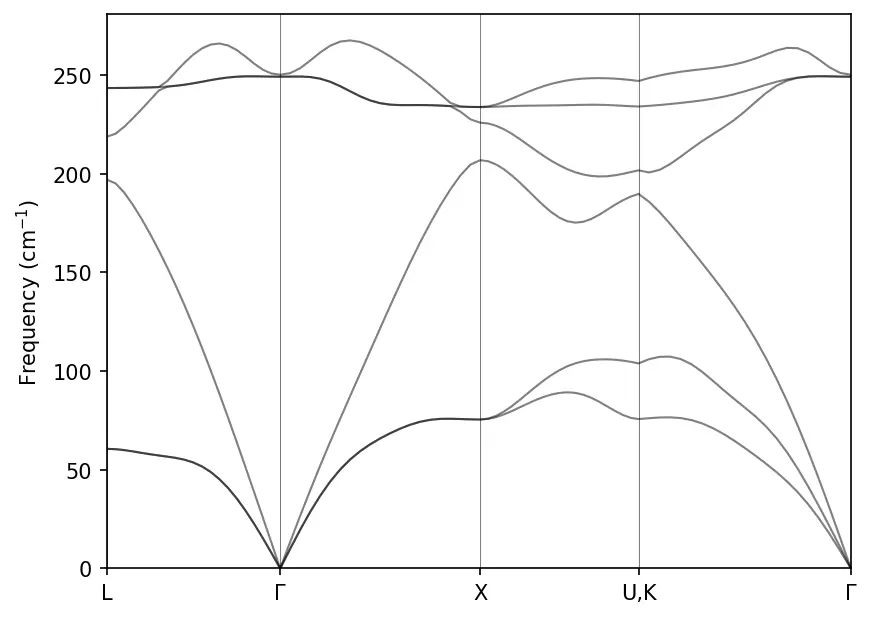

In Quantum Espresso, phonon dispersion is calculated using `ph.x` program, which
is implementation of [density functional perturbation theory (DFPT)](
https://doi.org/10.1103/RevModPhys.73.515).

Here are the steps for calculating phonon dispersion:

(1) perform SCF calculation using `pw.x`

import CodeBlock from '@theme/CodeBlock';
import scf_GaAs_in from '!!raw-loader!/src/GaAs-phonon/pw.scf.GaAs.in';

<CodeBlock language="bash" title="src/GaAs-phonon/pw.scf.GaAs.in" showLineNumbers>{scf_GaAs_in}</CodeBlock>

We perform the SCF calculation:

```bash
mpirun -np 4 pw.x -i pw.scf.GaAs.in > pw.scf.GaAs.out
```

:::info

1. Usually higher energy cutoff values are used for phonon calculation to get
better accuracy.

2. In case of two dimensional systems, use `assume_isolated = '2D'` in the
`SYSTEM` namelist to avoid negative or imaginary acoustic frequencies near
$\Gamma$ point. Read more [here](https://doi.org/10.1103/PhysRevB.96.075448).

:::


(2) calculate the dynamical matrix on a uniform mesh of q-points using `ph.x`

import ph_GaAs_in from '!!raw-loader!/src/GaAs-phonon/ph.GaAs.in';

<CodeBlock language="bash" title="src/GaAs-phonon/ph.GaAs.in" showLineNumbers>{ph_GaAs_in}</CodeBlock>

Run the calculation:

```bash
mpirun -np 4 ph.x -i ph.GaAs.in > ph.GaAs.out
```

The above calculation is computationally demanding. Our example calculation took
about a whole day on a 2.6 GHz quad core processor.

:::info

You can restart an interrupted `ph.x` calculation with `recover = .true.` in the
`INPUTPH` namelist. You can cleanly exit an ongoing calculation by creating an
empty file with name `{prefix}.EXIT`.

:::


(3) perform inverse Fourier transform of the dynamical matrix to obtain inverse
Fourier components in real space using `q2r.x`. Below is our input file:

import q2r_GaAs_in from '!!raw-loader!/src/GaAs-phonon/q2r.GaAs.in';

<CodeBlock language="bash" title="src/GaAs-phonon/q2r.GaAs.in" showLineNumbers>{q2r_GaAs_in}</CodeBlock>

```bash
mpirun -np 4 q2r.x -i q2r.GaAs.in > q2r.GaAs.out
```

(4) Finally, perform Fourier transformation of the real space components to get
the dynamical matrix at any q by using `matdyn.x`.

import matdyn_GaAs_in from '!!raw-loader!/src/GaAs-phonon/matdyn.GaAs.in';

<CodeBlock language="bash" title="src/GaAs-phonon/matdyn.GaAs.in" showLineNumbers>{matdyn_GaAs_in}</CodeBlock>

```bash
mpirun -np 4 matdyn.x -i matdyn.GaAs.in > matdyn.GaAs.out
```

We can now plot the phonon dispersion of GaAs:

```py title="notebooks/GaAs-phonon.ipynb"
import numpy as np
import matplotlib.pyplot as plt

data = np.loadtxt("../src/GaAs-phonon/GaAs.freq.gp")

nbands = data.shape[1] - 1
for band in range(nbands):
    plt.plot(data[:, 0], data[:, band], linewidth=1, alpha=0.5, color='k')
# High symmetry k-points (check matdyn.GaAs.in)
plt.axvline(x=data[0, 0], linewidth=0.5, color='k', alpha=0.5)
plt.axvline(x=data[20, 0], linewidth=0.5, color='k', alpha=0.5)
plt.axvline(x=data[40, 0], linewidth=0.5, color='k', alpha=0.5)
plt.axvline(x=data[60, 0], linewidth=0.5, color='k', alpha=0.5)
plt.xticks(ticks= [0, data[20, 0], data[40, 0], data[60, 0], data[-1, 0]], \
           labels=['L', '$\Gamma$', 'X', 'U,K', '$\Gamma$'])
plt.ylabel("Frequency (cm$^{-1}$)")
plt.xlim(data[0, 0], data[-1, 0])
plt.ylim(0, )
plt.show()
```



:::tip

We may need to lower the value of `conv_thr` in `scf` calculation for more
accurate result.

:::

### Phonon Density of States

Input file for phonon DOS calculation:

import matdyn_dos_GaAs_in from '!!raw-loader!/src/GaAs-phonon/matdyn.dos.GaAs.in';

<CodeBlock language="bash" title="src/GaAs-phonon/matdyn.dos.GaAs.in" showLineNumbers>{matdyn_dos_GaAs_in}</CodeBlock>

Plot phonon DOS:

```py title="notebooks/GaAs-phonon.ipynb"
freq, dos, pdos_Ga, pdos_As = np.loadtxt("../src/GaAs-phonon/GaAs.dos", unpack=True)

plt.plot(freq, dos, c='k', lw=0.5, label='Total')
plt.plot(freq, pdos_Ga, c='b', lw=0.5, label='Ga')
plt.plot(freq, pdos_As, c='r', lw=0.5, label='As')
plt.xlabel('$\\Omega~(cm^{-1}$)')
plt.ylabel('Phonon DOS (state/cm$^{-1}/u.c.$)')
plt.legend(frameon=False, loc='upper left')
plt.xlim(freq[0], freq[-1])
plt.show()
```


## Resources

- [School on Electron-Phonon Physics from First Principles (2018)](https://indico.ictp.it/event/8301/other-view?view=ictptimetable) ([Video lectures on YouTube](https://www.youtube.com/playlist?list=PLYc-eBoIpXTIboem6dKTYD1-1m0sMYnYz))
- https://github.com/nguyen-group/QE-SSP
