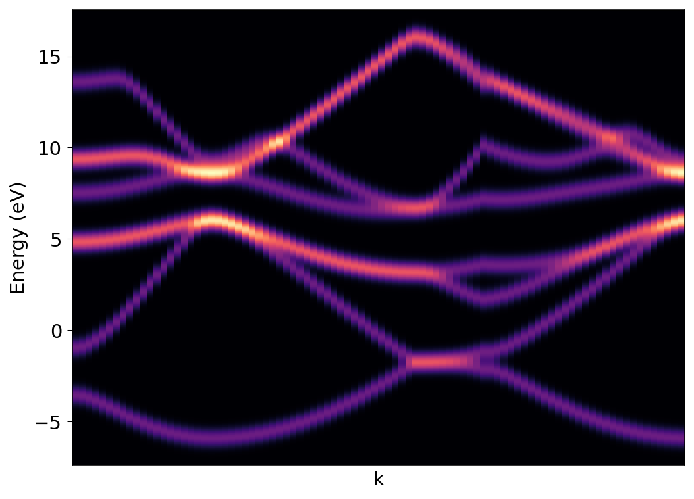

### k-resolved pDOS
Here we will calculate k-resolved density of states. First we begin with self consistent field calculation. Here is the input:
```
&CONTROL
  calculation = 'scf'
  prefix = 'silicon'
  outdir = './tmp/' 
  pseudo_dir = '../pseudo/'
  verbosity = 'high'
/

&SYSTEM
  ibrav =  2
  celldm(1) = 10.26
  nat =  2,
  ntyp = 1,
  ecutwfc = 50
  nbnd = 8
/

&ELECTRONS
  mixing_beta = 0.5
/

ATOMIC_SPECIES
  Si 28.086 Si.pz-vbc.UPF

ATOMIC_POSITIONS (alat)
  Si 0.0 0.0 0.0
  Si 0.25 0.25 0.25

K_POINTS (automatic)
  8 8 8 0 0 0 
```

We run the pw.x calculation:
```
$ pw.x -inp si-scf.in > si-scf.out 
```

Next we perform the band calculation. Input as follows: 
```
&CONTROL
  calculation = 'bands'
  prefix = 'silicon'
  outdir = './tmp/' 
  pseudo_dir = '../pseudo/'
  verbosity = 'high'
/

&SYSTEM
  ibrav =  2
  celldm(1) = 10.26
  nat =  2,
  ntyp = 1,
  ecutwfc = 50
  nbnd = 8
/

&ELECTRONS
  mixing_beta = 0.5
/

ATOMIC_SPECIES
  Si 28.086 Si.pz-vbc.UPF

ATOMIC_POSITIONS (alat)
  Si 0.0 0.0 0.0
  Si 0.25 0.25 0.25

K_POINTS {crystal_b}
5
  0.0000 0.5000 0.0000 20  !L
  0.0000 0.0000 0.0000 30  !G
  -0.500 0.0000 -0.500 10  !X
  -0.375 0.2500 -0.375 30  !U
  0.0000 0.0000 0.0000 20  !G
```
```
$ pw.x -inp si-bands.in > si-bands.out 
```
Calculate the orbital projections with k-resolved information:
```
&projwfc
    outdir       = './tmp/'
    prefix       = 'silicon'
    ngauss       = 0
    degauss      = 0.036748
    DeltaE       = 0.005
    kresolveddos = .true.
    filpdos      = 'silicon.k'
/
```

```
$ projwjc.x inp si-projwfc.in > si-projwfc.out
```

This will give separate orbital projections, as well as total sum for k-resolved DOS. We can sum desired projections using `sumpdos.x` as well. For example: 
```
sumpdos.x *\(Cl\)*\(p\) > Cl_2p_tot.dat
```

{:style="width:600px"} 

**Note:** If you are using `ibrav=0`, you can calculate `projwfc` with `lsym=.false.` option. 
