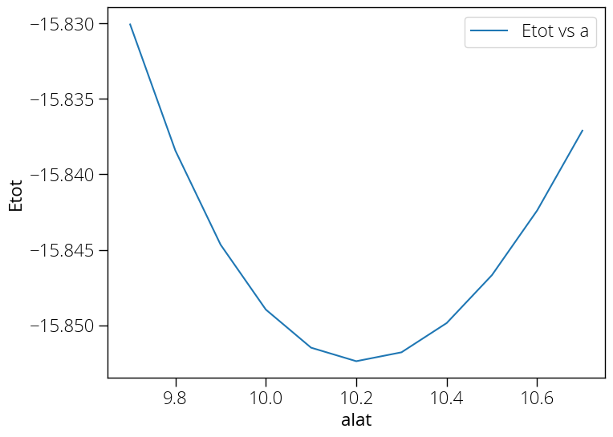

### Convergence against lattice constant 

Calculating total energy with respect to varying lattice constant. 
```
load_fromPWI si.scf.in

# please uncomment & insert value as determined in the "ecutwfc" exercise
SYSTEM { ecutwfc = 30 }

# please uncomment & insert values as determined in the "kpoints" exercise
K_POINTS automatic { 6 6 6 1 1 1 }


set fid [open Etot-vs-alat.dat w]

foreach alat { 9.7 9.8 9.9 10.0 10.1 10.2 10.3 10.4 10.5 10.6 10.7 } {

    set name pw.Si.scf.alat-$alat

    SYSTEM "celldm(1) = $alat"
    runPW $name.in

    set Etot [::pwtk::pwo::totene $name.out]
    puts $fid "$alat $Etot"    
} 

close $fid

```
Run above code: 
```
pwtk alat.pwtk
```

{:style="width:500px"} 
