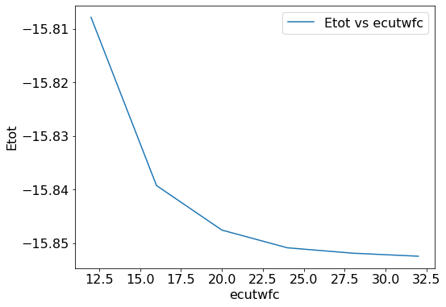

#### Convergence test using `pwtk` 

We can automate the previous self consistent calculation by varying a certain parameter. Say we want to check the total energy of the system for various values of `ecutwfc`. We can do that by using `pwtk` script. 
``` 
# load the pw.x input from file
load_fromPWI si.scf.in

# open a file for writing resulting total energies
set fid [open Etot-vs-ecutwfc.dat w]

# loop over different "ecut" values
foreach ecut { 12 16 20 24 28 32 } {

    # name of I/O files: $name.in & $name.out
    set name si.scf.ecutwfc-$ecut

    # set the pw.x "ecutwfc" variable
    SYSTEM "ecutwfc = $ecut"

    # run the pw.x calculation
    runPW $name.in

    # extract the "total energy" and write it to file
    set Etot [::pwtk::pwo::totene $name.out]
    puts $fid "$ecut $Etot"
} 

close $fid
``` 

To run the above script: 
```
pwtk ecutwfc.pwtk
```

Now we can plot the total energy with respect to ecutwfc. The data is in `Etot-vs-ecutwfc.dat` 

{:style="width:500px"} 

#### Convergence test using UNIX shell script 
+ We can do the convergence test with various parameters. We can calculate the total energy of the system by varying various parameters. We will use the shell script to automate the process with different cutoff energy values. `./si.script.sh`
```
#!/bin/sh

NAME="ecut"

for CUTOFF in  10 15 20 25 30 35 40
do
cat > ${NAME}_${CUTOFF}.in << EOF
&control
calculation = 'scf',
prefix = 'silicon'
outdir = './tmp/'
pseudo_dir = '/Users/Pranab/Dropbox/Shared/NUS_PC/DFT/Projects/Si/'
/
&system
ibrav =  2,
celldm(1) = 10.0,
nat =  2,
ntyp = 1,
ecutwfc = $CUTOFF
/
&electrons
mixing_beta = 0.6
/

ATOMIC_SPECIES
 Si 28.086  Si.pz-vbc.UPF

ATOMIC_POSITIONS (alat)
 Si 0.0 0.0 0.0
 Si 0.25 0.25 0.25

K_POINTS (automatic)
  6 6 6 1 1 1
EOF

~/qe/qe-6.5/bin/pw.x < ${NAME}_${CUTOFF}.in > ${NAME}_${CUTOFF}.out
echo ${NAME}_${CUTOFF}
grep ! ${NAME}_${CUTOFF}.out

done
``` 

+ We can plot the energy vs cut off energy, and choose a reasonable value. 

**Note:** I had initially problem is running the script in macOS. The problem was the script file format was set to DOS. The file format of a script (.sh) file could be checked in the following way:  
Open the file in **vi** editor. `vi si.script.sh` Now in **vi** editor command mode (ESC key), type `:set ff?` This would tell you the file format. Now to change file format, use the  command `:set fileformat=unix`
