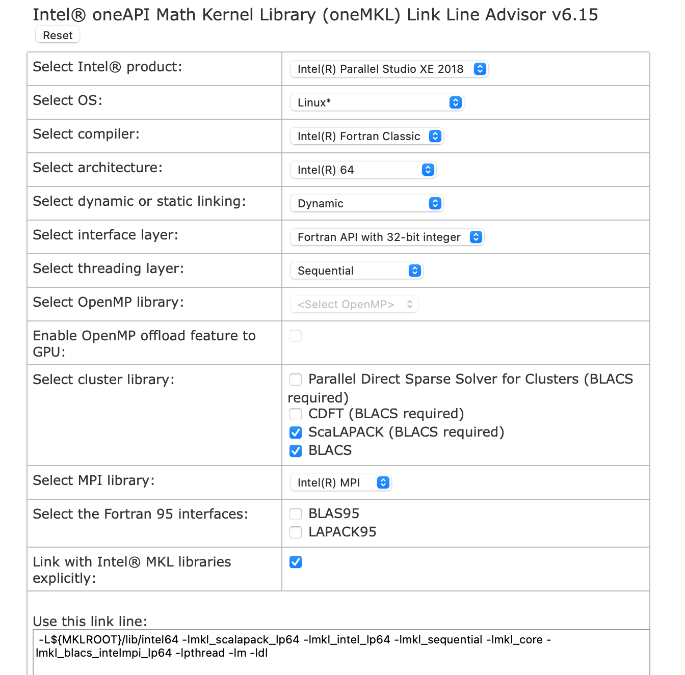

In order to perform computationally heavy calculations, we would require access
to high performance computing facilities.

## Useful UNIX commands

Connect to a login node via ssh:
```bash
ssh {username}@atlas9.nus.edu.sg
```

Secure copy files between local and remote machines:
```bash
scp {username}@10.10.0.2:/remote/file.txt /local/directory
scp local/file.txt {username}@10.10.0.2:/remote/directory
```

Check disk usage:
```bash
du -hs .
du -hs /path/
```

Rsync to synchronize two folders:
```bash
rsync -azhv --delete /source/my_project/ /destination/my_project
```

## Running jobs at NUS HPC

Check your storage quota:
```bash
hpc s
```

PBS commands:
```bash
hpc pbs summary
```

Example scrips for job submissions:
```bash
hpc pbs script parallel20
hpc pbs vasp
```

List available modules:
```bash
module avail
```

Load a module:
```bash
module load {module-name}
```

Purge loaded modules:
```bash
module purge
```

Quantum Espresso is already installed in NUS HPC clusters. Here is a sample job
script for [NUS HPC](https://nusit.nus.edu.sg/hpc/) clusters:
```bash title="my_sample_job.txt"
#!/bin/bash
#PBS -q parallel12
#PBS -l select=2:ncpus=12:mpiprocs=12:mem=45GB
#PBS -j eo
#PBS -N qe-job
source /etc/profile.d/rec_modules.sh
module load espresso6.5-intel_18
## module load espresso6.5-Centos6_Intel
cd $PBS_O_WORKDIR;
np=$( cat  ${PBS_NODEFILE} |wc -l );
mpirun -np $np -f ${PBS_NODEFILE} pw.x -inp qe-scf.in > qe-scf.out
```

:::info

Notice that the lines beginning with `#PBS` are actually PBS commands, not
comments. For comments, I am using `##`.

:::

Query about a queue systems:
```bash
qstat -q
```

Check status of a particular queue system:
```bash
qstat -Qx parallel20
```

Submitting a job:
```bash
qsub my_sample_job.txt
```

Check running jobs:
```bash
qstat
```

Details about a job:
```bash
qstat -f {job-id}
```

Stopping a job:
```bash
qdel {job-id}
```

## Abort and restart a calculation

If you need to modify certain parameter while the program is running, e.g., you
want to change the `mixing_beta` value because SCF accuracy is oscillation
without any sign of convergence. Create an empty file named `{prefix}.EXIT` in
the directory where you have the input file or in the `outdir` as set in the
`&CONTROL` card of input file.
```bash
touch {prefix}.EXIT
```

That will stop the program on next iteration, and save the state. In order to
restart, set the `restart_mode` in `&CONTROL` card to `'restart'` and re-run
after necessary changes. You must rerun with same number of processors.

```bash
&CONTROL
  ...
  restart_mode = 'restart'
  ...
/
```

## Compiling Quantum Espresso using Intel Math Kernel Libraries (MKL)
If you need a newer or specific version of Quantum Espresso that is not
installed in the NUS clusters, here are the steps that I followed. Download and
un-tar the source files.
```bash
wget https://github.com/QEF/q-e/releases/download/qe-6.7.0/qe-6.7-ReleasePack.tgz
tar zxvf qe-6.7-ReleasePack.tgz
```

Load the necessary modules:
```bash
module load xe_2018
module load fftw/3.3.7
```

Go to QE directory and run `configure`:
```bash
cd qe-6.7
./configure
```

You will see output something like:
```bash
...
BLAS_LIBS=  -lmkl_intel_lp64  -lmkl_sequential -lmkl_core
LAPACK_LIBS=
FFT_LIBS=
...
```
For me the `LAPACK_LIBS` and `FFT_LIBS` libs were not automatically detected. We
need to specify them manually. First get the link libraries line specific to
your version of software and other configurations from the [Intel link advisor](
https://software.intel.com/content/www/us/en/develop/tools/oneapi/components/onemkl/link-line-advisor.html)
. For my case, the link line was:
```bash
-L${MKLROOT}/lib/intel64 -lmkl_scalapack_lp64 -lmkl_intel_lp64 -lmkl_sequential -lmkl_core -lmkl_blacs_intelmpi_lp64 -lpthread -lm -ldl
```



We need to insert the link for `BLAS_LIBS`, `LAPACK_LIBS`, and `SCALAPACK_LIBS`.
We also need to find out where is the FFTW lib located. In NUS HPC, we can use
`module avail` command to see where a particular module is located, usually
under `/app1/modules/`. Open `make.inc` and make following changes
(highlighted):
```bash title="make.inc"
...
CFLAGS         = -O3 $(DFLAGS) $(IFLAGS)
F90FLAGS       = $(FFLAGS) -nomodule -fpp $(FDFLAGS) $(CUDA_F90FLAGS) $(IFLAGS) $(MODFLAGS)

# compiler flags with and without optimization for fortran-77
# the latter is NEEDED to properly compile dlamch.f, used by lapack
// highlight-start
FFLAGS         = -O3 -assume byterecl -g -traceback
// highlight-end
FFLAGS_NOOPT   = -O0 -assume byterecl -g -traceback
...
# If you have nothing better, use the local copy
# BLAS_LIBS = $(TOPDIR)/LAPACK/libblas.a
// highlight-start
BLAS_LIBS      = -L${MKLROOT}/lib/intel64 -lmkl_scalapack_lp64 -lmkl_intel_lp64 -lmkl_sequential -lmkl_core -lmkl_blacs_intelmpi_lp64 -lpthread -lm -ldl
// highlight-end
# If you have nothing better, use the local copy
# LAPACK_LIBS_SWITCH = internal
# LAPACK_LIBS = $(TOPDIR)/LAPACK/liblapack.a
// highlight-start
LAPACK_LIBS    = -L${MKLROOT}/lib/intel64 -lmkl_scalapack_lp64 -lmkl_intel_lp64 -lmkl_sequential -lmkl_core -lmkl_blacs_intelmpi_lp64 -lpthread -lm -ldl
// highlight-end
LAPACK_LIBS_SWITCH = external

// highlight-start
SCALAPACK_LIBS = -L${MKLROOT}/lib/intel64 -lmkl_scalapack_lp64 -lmkl_intel_lp64 -lmkl_sequential -lmkl_core -lmkl_blacs_intelmpi_lp64 -lpthread -lm -ldl
// highlight-end
# nothing needed here if the the internal copy of FFTW is compiled
# (needs -D__FFTW in DFLAGS)

// highlight-start
FFT_LIBS       = -L/app1/centos6.3/gnu/fftw/3.3.7/lib/ -lmpi
// highlight-end
...
```

Now we are ready to compile:
```bash
make all -j8
```

I am using 8 processors to speed things up. You may add the `qe-6.7/bin` path to
your `.bashrc`, and don't forget to load following modules before calling QE
executables.

```bash
module load xe_2018
module load fftw/3.3.7
```

:::note

If you are submitting job via PBS queue, you need to provide full path of the QE
executables, e.g., `/home/svu/{username}/qe-6.7/bin/pw.x`. PBS system won't read
your bash settings, neither relative paths of your login node would apply.

:::

## Resources
- <https://nusit.nus.edu.sg/services/getting-started/introductory-guide-for-new-hpc-users/>
- <https://help.nscc.sg/pbspro-quickstartguide/>
- <https://www.youtube.com/watch?v=doudMLEaq3w>
